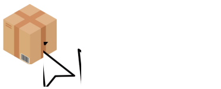

<h1>Your Storage - Solução para Gestão de Estoques</h1>

    <h3>Links para acesso:</h3>
    <a href='https://www.yourstorage.x10.mx/homepage/' target='_blank'>Your storage - Homepage</a> / 
    <a href='https://www.yourstorage.x10.mx/funcionario/' target='_blank'>Your storage - Funcionário</a> / 
    <a href='https://www.yourstorage.x10.mx/cliente/login/' target='_blank'>Your storage - Cliente</a>

 

<b>Your Storage</b> é um sistema desenvolvido para resolver os desafios do gerenciamento de estoques, oferecendo ferramentas robutas para organizar e monitorar bens e ativos, sejam físicos ou virtuais.

O sistema proporciona uma gestão integrada e eficiente, desde o cadastro inicial dos itens até a realização de movimentações. Além disso, <b>Your Storage</b> suporta múltiplos usuários, com sistema de permissões e tipos de usuários para criar uma estrutura hierárquica adaptada às necessidades de uma empresa.

Combinando flexibilidade, segurança e facilidade de uso, Your Storage é a escolha ideal para otimizar a administração de estoques e garantir o controle eficiente dos recursos corporativos.

<h2>Existência e motivo do projeto</h2>

A gestão de estoques é uma atividade crucial para o sucesso de qualquer empresa, independentemente de seu porte ou segmento de atuação. O cenário atual revela um conjunto de desafios que dificultam o controle eficiente de bens e ativos, sejam físicos ou virtuais, impactando diretamente a operação e a lucratividade das organizações.

Problemas como falta de visibilidade, dificuldade em rastrear movimentações, inconsistências causadas por processos manuais e ausência de padronização são recorrentes em muitas empresas. Essas falhas não apenas geram prejuízos financeiros, mas também comprometem o planejamento estratégico, atrasam a execução de projetos e afetam a confiança na tomada de decisão. Além disso, a ausência de um sistema hierárquico claro para gerenciar usuários e permissões pode expor dados sensíveis e aumentar o risco de erros operacionais.

Diante dessa realidade, a necessidade de uma solução robusta e eficiente torna-se evidente. É aqui que a Your Storage se destaca como uma ferramenta essencial, desenvolvida para enfrentar esses desafios de forma abrangente. O sistema centraliza e automatiza processos, proporcionando um controle sobre a movimentação de produtos, ativos e bens, além de permitir a criação de usuários com diferentes níveis de permissão, como administradores e estoquistas.

Com sua abordagem inovadora e flexível, a Your Storage oferece às empresas a capacidade de transformar a gestão de estoques em um diferencial estratégico, garantindo eficiência, segurança e controle total sobre os recursos corporativos.

<h3><a href='https://drive.google.com/drive/folders/1dfj4NNPGmdXQXXErL4cJ_q0BKYWZ9i0D?usp=sharing' target="_blank"> 📁 Arquivos completos (Fluxogramas, Casos de Uso, e Vídeo Funcionalidades)</a></h3>

<h2>Diagramas de Casos de Uso</h2>

<h3><a href='https://drive.google.com/drive/folders/13CWh8DLOfqSiTxicT4c0sElIxTnFvuTt?usp=sharing' target="_blank">Casos de Uso: Cliente</a></h3>

<h3><a href='https://drive.google.com/drive/folders/1sPMHAmVBec5f9IZobbl5DtJP6rTAr2Cy?usp=sharing' target="_blank">Casos de Uso: Funcionário</a></h3>

<h2>Processos e fluxos dentro do Sistema</h2>

<h3>Formulário</h3>

<a href='https://www.yourstorage.x10.mx/fluxogramas/Formul%C3%A1rio/fluxo.html'> 📜 Clique aqui para acessar processo e fluxo de Envio de Formulário</a>

<h3>Funcionário</h3>

<a href='https://www.yourstorage.x10.mx/fluxogramas/Funcion%C3%A1rio/fluxo.html'> 👨‍💼 Clique aqui para acessar processos e fluxos de Funcionários</a>

<h3>Cliente</h3>

<a href='https://www.yourstorage.x10.mx/fluxogramas/Cliente/fluxo.html'> 🤝 Clique aqui para acessar processos e fluxos de Clientes</a>

<h2>Requisitos Funcionais e Não Funcionais</h2>

<h3>--- Funcionais ---</h3>

<h4> 📜 Formulário:</h4>

- O sistema permite o envio de um formulário com uma mensagem ou não.

- O formulário coleta dados cadastrais do cliente, e salva em um banco de dados

- O sistema envia email padrão ao destinatário (que imputou o email no formulário).

<h4> 👨‍💼 Funcionário:</h4>

- O sistema precisa que um funcionário logue utilizando email e senha.

- O sistena permite a recuperação de senha, caso o usuário esqueça.

- O sistema permite o cadastro, edição, e exclusão de funcionários, empresas, clientes e storages.

- O sistema permite a exportação de dados em formatos Excel e PDF.

<h4> 🤝 Cliente (Administrador):</h4>

- É capaz de cadastrar (segundo o plano contratado), editar e excluir produtos e clientes.

- É capaz de movimentar o estoque, incluindo entrada e saída de produtos.

<h4> 🤝 Cliente (Estoquista):</h4>

- É capaz de cadastrar (segundo o plano contratado), editar e excluir produtos apenas.

- É capaz de movimentar o estoque, incluindo entrada e saída de produtos.

<h3>--- Não Funcionais ---</h3>

<h4>🔒 Segurança:</h4>

- O sistema garante que, somente usuários autenticados possam ralizar operações dentro dos sistemas (Funcionário e Cliente).

- O sistema criptografa todas as senhas, armazenadas no banco de dados.

- O sistema de recuperação de senha é seguro, enviando por email e autenticando código para redefinição de senha de acesso.

- O sistema (Cliente) garante que cada tipo de cliente, tenha acesso somente as funcionalidades que são relevantes a ele.

<h4>🛡️ Integridade de Dados:</h4>

- O sistema valida dados inseridos em cadastros e edições, para garantir que não haja duplicidade ou confusão.

- Durante os processos de cadastro, edição e exclusão de dados, o sistema garante que estes dados sejam operados corretamente no banco de dados.

<h4>🚀 Desempenho:</h4>

- O tempo de resposta do sistema não excede 5 segundos.

- A geração de relatórios (Sistema Funcionário) e exportação de dados, é realizado rapidamente mesmo em grandes volumes de informação.

<h2>Este é o fim desta documentação! Obrigado por chegar até aqui, e acompanhe o projeto Your Storage em suas futuras atualizações. Até Breve! 👋</h2>